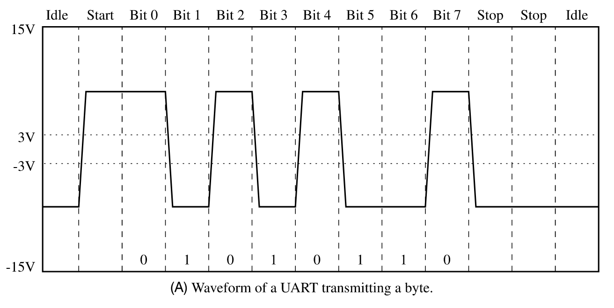

# How does UART send data
It sends data sequentially, and the receiver joins them together and parses the
data. Before sending a group of data[^1] the transmitter sends one start bit.
And then starts sending the data in the form of voltage spikes[^2]. After the
one group is sent, the transmitter sends two stop bits, as low voltage signals.
This allows the receiver some time to process and be ready for next group of
bits.

[^1]: Whose size is preconfigured to be the same between transmitter and
  receiver
[^2]: High voltage representing 1, and vice versa
